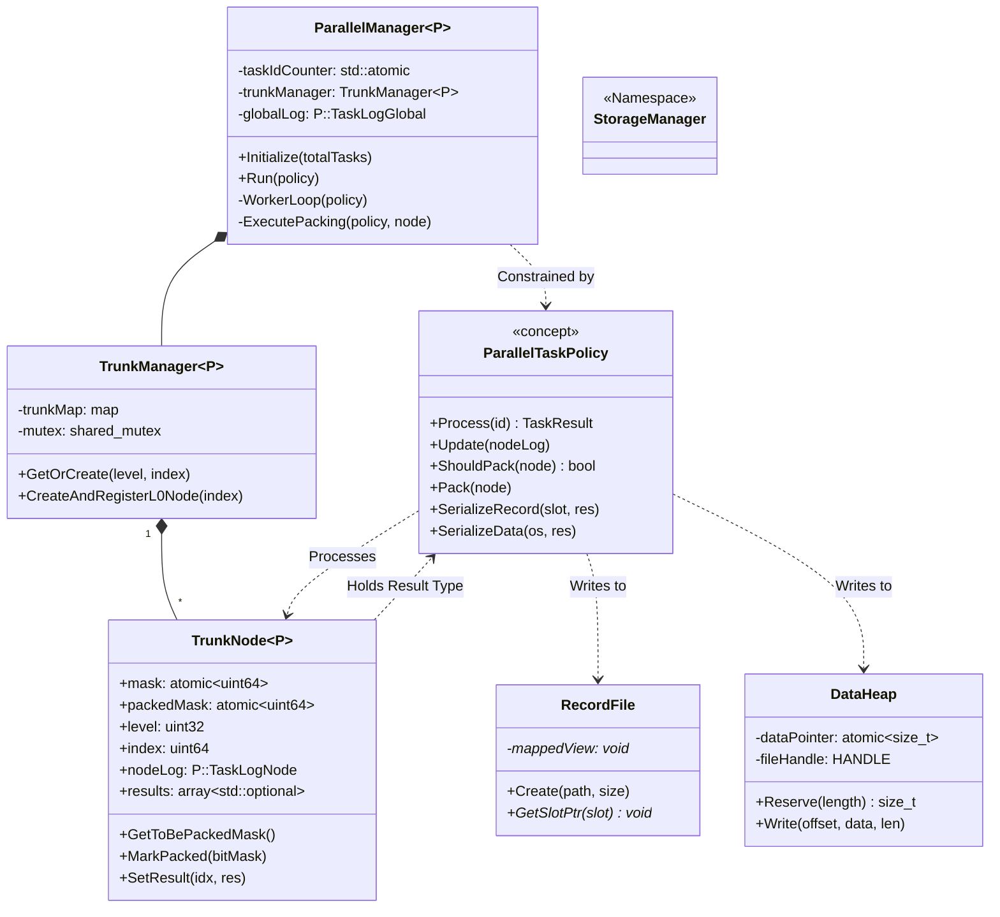
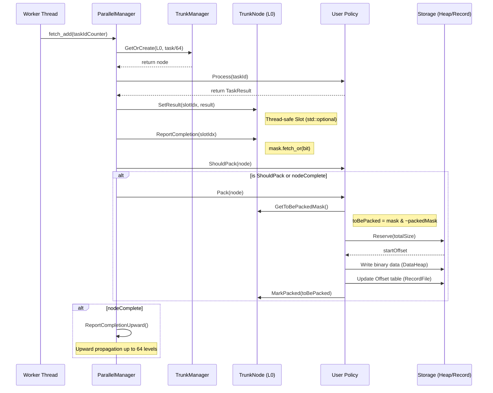

# ParallelMerge 框架详细架构设计报告

本文档旨在提供 `ParallelMerge` 框架的详细技术实现视图，涵盖类结构设计与核心执行流程。

## 1. 类结构图 (Class Structure)

该框架基于策略模式（Policy Pattern）设计，通过 C++20 Concept 约束用户行为，将调度逻辑与具体任务逻辑解耦。

---

## 2. 执行流程图 (Execution Flow)

下图展示了一个工作线程从获取任务到触发跨节点装箱的典型生命周期。

---

## 3. 核心设计要点说明

### A. 双掩码并发装箱 (Dual-Mask Interaction)
为了支持“任务按需打包”而不必等待整个 Trunk 完成，我们引入了两个 64 位原子掩码：
- **`mask`**: 追踪哪些 slot 的任务已经算完了（Process 完毕）。
- **`packedMask`**: 追踪哪些 slot 的数据已经存入磁盘了（Pack 完毕）。
- **逻辑**: `toBePacked = mask & (~packedMask)`。这一步确保了即便 `Pack()` 在多个线程中由于不同触发条件（如每满 8 项打一次包）被重入，也能通过原子 `fetch_or` 保证“每一项只被打包一次”。

### B. 无竞争结果存储 (Lock-free Result Slots)
L0 节点内部使用 `std::array<std::optional<TaskResult>, 64>`。
- **原理**: 每个任务 ID 映射到唯一的 `slot = taskId % 64`。
- **优势**: 只要 `Process` 是并行的，线程可以直接写属于自己的槽位，无需对整个节点加锁。只有在修改节点全局的 `mask` 或 `nodeLog` 时才进行原子操作或轻量级同步。

### C. 层次化传播 (Hierarchical Reporting)
框架支持多达 64 层的树状结构（理论支持 $64^{64}$ 个任务）。
- 当一个节点的 `mask == targetMask` 时，它会递归调用父节点的 `ReportCompletion`。
- 根节点的完成触发全局 `OnFinalize` 回调。

### D. 高性能 I/O 链路
- 记录表使用 **Memory Mapped File**，将磁盘 IO 转为内存写，由 OS 异步刷盘。
- 数据堆使用 **Atomic Space Reservation**。所有线程先通过一个原子加法“占坑”，获得全局唯一的 Offset，然后各自并行执行异步 IO (`WriteFile` with `OVERLAPPED`)，互不阻塞。
